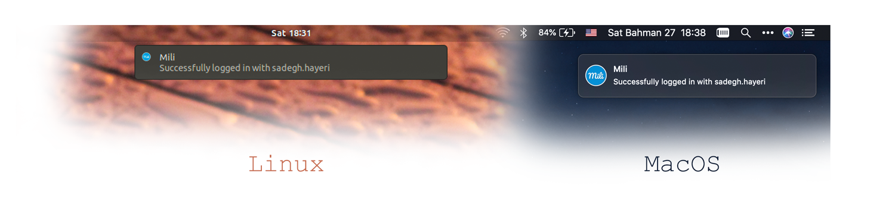

# Mili
<p align="center">
  
</p>

<p align="center">
	 
</p>


### Never see login pages again!

Mili is an open source tool for auto login hotspot pages. if you are tired of inserting username and password for internet access, Mili is your friend!

Every time you connect to a new WiFi, Mili checks Mikrotik services and try to login.

<p align="center">
	
</p>

In addition, you can set more than one login info (for example your close friend password)
for Mili. every time Mili tries to use a random user! (yes! you can set **share percentage** too)

Example:
```
"login_information" : [
		{
			"username": "USER 1",
			"password": "PASS 1",
			"share": 5
		},
		{
			"username": "USER 2",
			"password": "PASS 2",
			"share": 1
		},
	]
```

### Installation
```
git clone https://github.com/SadeghHayeri/Mili.git
cd Mili/scripts
./install.sh
```

##### MacOnly (disable captive popup page)
`this is optional`
1. Restart your Mac.
2. Before OS X starts up, hold down Command-R and keep it held down until you see an Apple icon and a progress bar. Release. This boots you into Recovery.
3. From the Utilities menu, select Terminal.
4. At the prompt type exactly the following and then press Return: csrutil disable
5. Terminal should display a message that SIP was disabled.
6. In the Finder, select Go > Go To Folder.
7. Enter /System/Library/CoreServices and hit return.
8. Find Captive Network Assistant, click it, and rename it with an extra word, like Captive Network Assistant Do Not Launch and press return.
9. Enter your password when prompted to make the change.
10. From the  menu, select Restart.

### Usage

##### `Init/change configs`
```
mili config
```

##### `Check and login`
```
mili
```

##### `Force login`
```
mili login
```

##### `Login with specific user (password must saved before)`
```
mili login <UserName>
```

##### `Status`
```
mili status
```

##### `Logout`
```
mili logout
```
