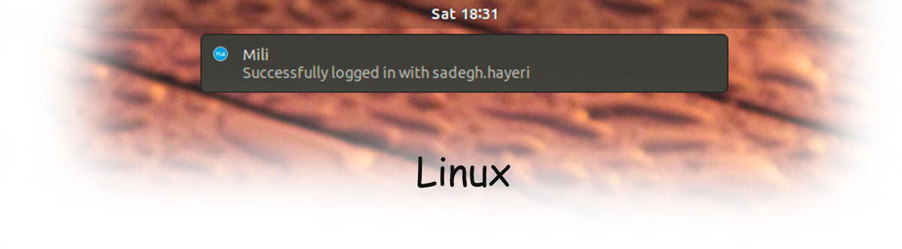
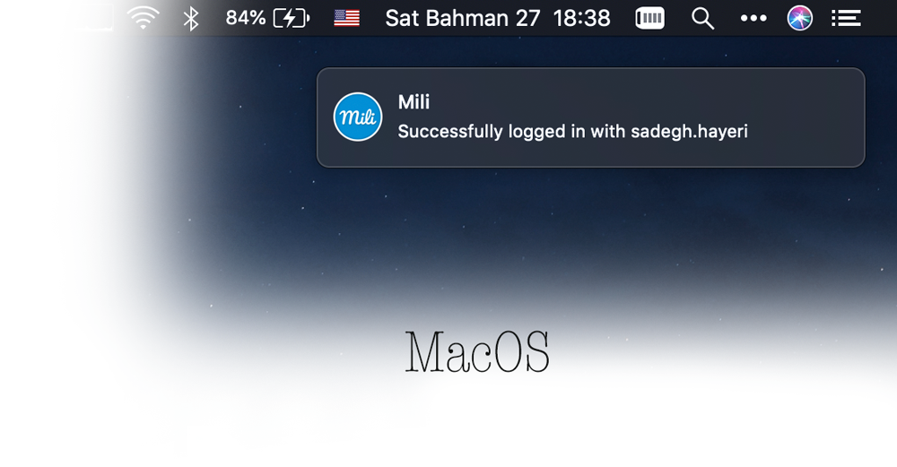

# Mili
<p align="center">
  
</p>

<p align="center">
	 
</p>


### Never see login pages again!

Mili is an open source tool for auto login hotspot pages. if you are tired of inserting username and password for internet access, Mili is your friend!

Every time you connect to a new WiFi, Mili checks Mikrotik services and try to login.

<p align="center">
	 
</p>

In addition, you can set more than one login info (for example your close friend password)
for Mili. every time Mili tries to use a random user! (yes! you can set **share percentage** too)

Example:
```
"login_information" : [
		{
			"username": "USER 1",
			"password": "PASS 1",
			"share": 5
		},
		{
			"username": "USER 2",
			"password": "PASS 2",
			"share": 1
		},
	]
```

### Installation
```
git clone https://github.com/SadeghHayeri/Mili.git
cd Mili/scripts
./install.sh
```

### Usage

##### `Init/change configs`
```
mili config
```

##### `Check and login`
```
mili
```

##### `Force login`
```
mili login
```

##### `Login with specific user (password must saved before)`
```
mili login <UserName>
```

##### `Status`
```
mili status
```

##### `Logout`
```
mili logout
```
